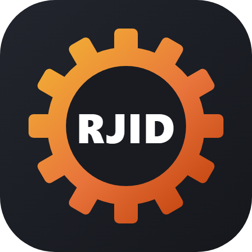
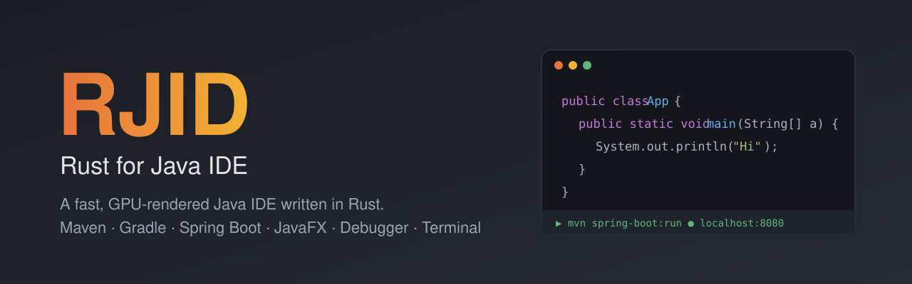
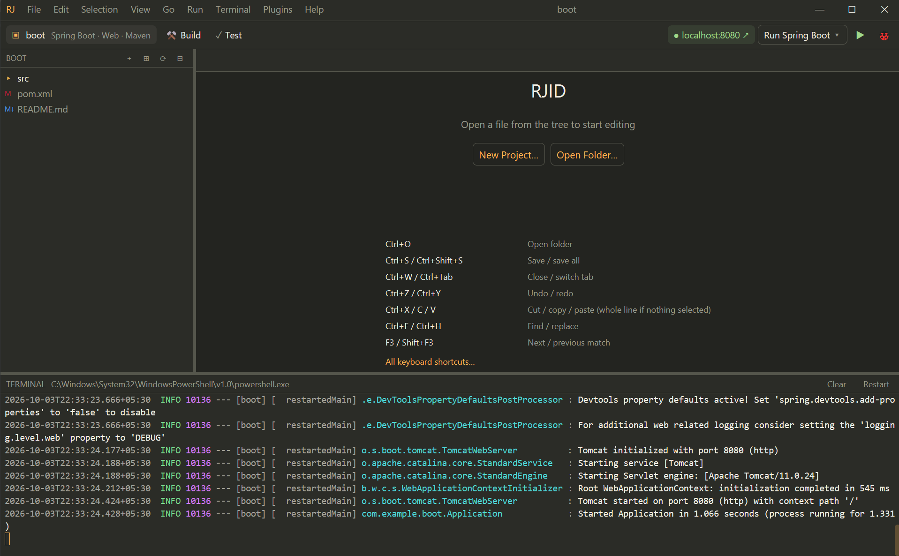
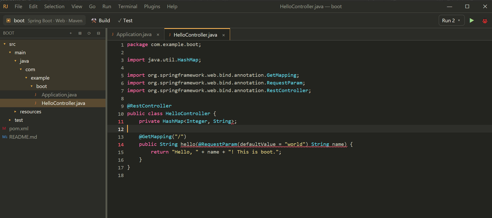
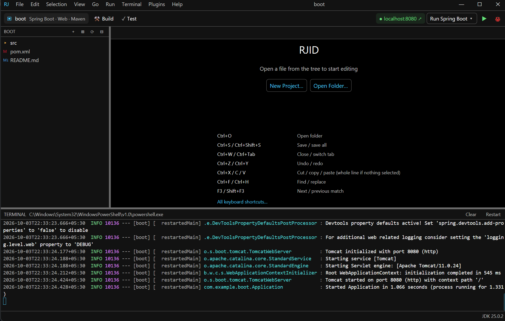

<p align="center">
  
</p>

<h1 align="center">RJID — Rust for Java IDE</h1>

<p align="center">
  
</p>

<p align="center">
  <b>A fast, GPU-rendered Java IDE written in Rust.</b><br>
  Maven · Gradle · Spring Boot · JavaFX · debugger · terminal · in one native window.
</p>

<p align="center">
  <a href="LICENSE"></a>
  
  
  
</p>

---

## Why RJID

Java IDEs are powerful but heavy. RJID is an experiment in the other direction: a
Java IDE that starts in a moment and stays responsive, written from scratch in Rust
on [GPUI](https://github.com/zed-industries/zed/tree/main/crates/gpui) (the GPU UI
framework behind the Zed editor). It doesn't reinvent Java tooling. It drives the
tools you already have (the JDK, Maven, Gradle and the Eclipse JDT Language Server)
from one fast native window.

<p align="center">
  
  <br><sub>One click on ▶ runs a Spring Boot app; when Tomcat is up, a <b>localhost:8080 ↗</b> link appears in the toolbar.</sub>
</p>

<table>
  <tr>
    <td width="50%"></td>
    <td width="50%"></td>
  </tr>
  <tr>
    <td align="center"><sub>Java editing with live diagnostics from jdtls</sub></td>
    <td align="center"><sub>One of 13 built-in themes (high contrast)</sub></td>
  </tr>
</table>

## Features

- **Project-aware** — recognizes plain Java, Maven, Gradle, Spring Boot, JavaFX and
  Android; Build / Test / ▶ Run just do the right thing.
- **New Project wizard** — console, Spring Boot web or JavaFX, with Maven, Gradle or
  no build tool.
- **Java intelligence** — completion with auto-import, hover docs, live errors and
  quick fixes, rename, refactorings, and a VS Code-style **Source Action** menu
  (generate, override, organize imports…). The language server is set up for you
  on first use.
- **Navigation** — Ctrl+Click / F12 to jump to any definition (including JDK
  sources), **Ctrl+P** to open any file, **Ctrl+Shift+P** for every command.
- **Debugger** — breakpoints, stepping, variables and call stack; attach to a
  running JVM.
- **Terminal** — real VT terminal with tabs; build results in green / red, and a
  one-click **localhost ↗** link when your server starts.
- **Build files** — dependency changes re-import automatically, with missing
  versions fixed for you.
- **Toolchain updates** — knows when your JDK, Maven, Spring Boot or JavaFX have
  updates; safe ones can apply themselves if you allow it.
- **Your look** — 13 themes, your favorite coding fonts, zoom, movable panels,
  auto-save, and a layout that works down to 400×500.
- **Portable & extensible** — settings live next to the app; sandboxed
  WebAssembly plugins; early Android support.

There's more to find — Help ▸ Keyboard Shortcuts and the Command Palette are good
places to start.

## Get RJID

RJID is distributed as **source only** for now. Build it yourself:

```bash
git clone https://github.com/ai-avinashkp/RJID.git
cd RJID
cargo run --release -p rji-app
```

**Requirements**

| To build | To use the Java features |
|---|---|
| Rust 1.88+ (edition 2024) | A JDK (17+ recommended) |
| Windows 10/11 (macOS/Linux untested) | Maven and/or Gradle for those projects |
| | JDK 21+ for the Java language server, which RJID downloads on first use (or uses your VS Code Java extension / `JDTLS_HOME`) |

The first build downloads and compiles GPUI and takes a few minutes; rebuilds are
quick. The binary is `target/release/rjid` (`rjid.exe` on Windows):
`rjid <folder>` opens a project, `rjid <File.java>` opens a file in its project.

## Keyboard shortcuts

| Keys | Action |
|---|---|
| Ctrl+P / Ctrl+Shift+P | Go to file / command palette |
| F12 or Ctrl+Click | Go to definition |
| Ctrl+Space | Completion |
| Ctrl+. / F2 | Quick fix / rename symbol |
| Shift+Alt+S | Source action (generate, override, …) |
| Shift+Alt+O / Shift+Alt+F | Organize imports / format document |
| Ctrl+F / Ctrl+H / Ctrl+G | Find / replace / go to line |
| F5 / Shift+F5 | Debug / stop |
| F8 / F10 / F11 / Shift+F11 | Continue / step over / into / out |
| Ctrl+B / Ctrl+` / Ctrl+Shift+` | Toggle file tree / terminal / new terminal |
| Ctrl+= / Ctrl+- / Ctrl+0 | Zoom |

All shortcuts are listed under Help ▸ Keyboard Shortcuts.

## Status

RJID is an **early preview**. It's developed and tested on Windows; macOS and Linux
builds are written but untested. What works, how it was verified, and the honest list
of limitations are in [docs/ROADMAP.md](docs/ROADMAP.md). Changes are recorded in
[CHANGELOG.md](CHANGELOG.md).

## License

RJID is **source-available, not open source.** It's licensed under the
[PolyForm Noncommercial License 1.0.0](LICENSE):

- ✅ Free for personal use, study, research, hobby projects, and noncommercial
  organizations (charities, schools, public research, government bodies).
- ✅ You may read, build, modify and share it for those purposes, keeping the
  license and copyright notice.
- ❌ **Commercial use is not permitted** without a separate license. That includes
  using it inside a company for business, selling it, bundling it, or offering it as
  a service.

For a commercial license, contact the author (see the copyright notice in
[LICENSE](LICENSE)).

RJID bundles no third-party IDE code. It's built on Apache-2.0 / MIT / BSD
libraries (GPUI, alacritty_terminal, wasmi and others) listed in
[THIRD_PARTY_LICENSES.md](THIRD_PARTY_LICENSES.md). The JDK, Maven, Gradle and
jdtls are run as separate programs that you install yourself.

## Contributing

Issues and ideas are welcome. Before sending a pull request, please read
[CONTRIBUTING.md](CONTRIBUTING.md). Contributions have to be licensable under the
project's terms, including future commercial licensing.
